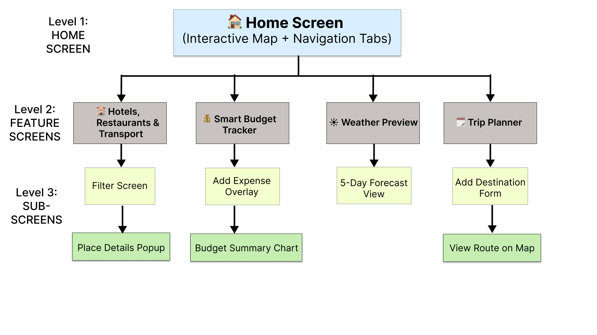

# TripMate UX Design

## App Map

**Description:**  
The App Map below shows the hierarchical structure of the TripMate mobile application.

- **Level 1 – Home Screen (Main Hub):** Central dashboard with an interactive map and navigation tabs.
- **Level 2 – Feature Screens:** Dedicated pages for Hotels, Budget Tracker, Weather, and Trip Planner.
- **Level 3 – Sub-Screens / Dynamic Views:** Overlays and popups such as Filter Screen, Add Expense Overlay, Forecast View, and Add Destination Form.

---

## Wireframes (Coming Next)
Once wireframe PNGs are exported from Figma, they’ll be added to this section and stored in `/ux-design/`.

