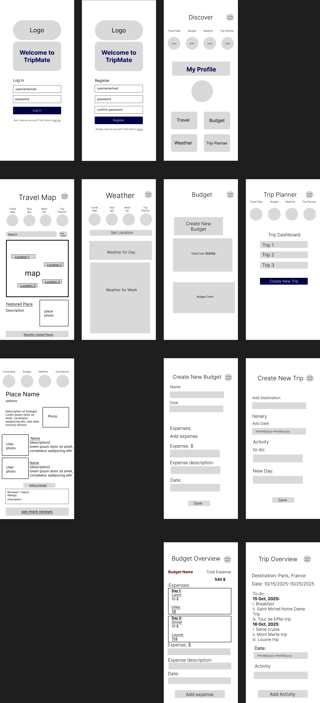

# TripMate UX Design

## App Map

**Description:**  
The App Map below shows the hierarchical structure of the TripMate mobile application.

- **Level 1 – Home Screen (Main Hub):** Central dashboard with an interactive map and navigation tabs.
- **Level 2 – Feature Screens:** Dedicated pages for Hotels, Budget Tracker, Weather, and Trip Planner.
- **Level 3 – Sub-Screens / Dynamic Views:** Overlays and popups such as Filter Screen, Add Expense Overlay, Forecast View, and Add Destination Form.
  
### Source File: [TripMate-App-Map.fig](ux-design/TripMate-App-Map.fig)
---

## Wireframes (Coming Next)
Once wireframe PNGs are exported from Figma, they’ll be added to this section and stored in `/ux-design/`.

## WireFrame

## Prototype
[View Figma Prototype](https://www.figma.com/proto/l6AJqNSxcxSOIPM1qC86hL/fishy-wireframes?node-id=1-2&p=f&t=8RGrhXE3V84Rqgrf-1&scaling=scale-down&content-scaling=fixed&page-id=0%3A1&starting-point-node-id=1%3A2)
